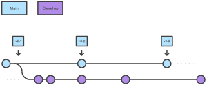

# GitFlow Branching Strategy

## Introduction

This project uses the GitFlow branching strategy. This strategy is a branching model that helps developers keep track of features, hotfixes, and releases in a project. It is a set of rules that define how and when branches are created, merged, and deleted.

## How it works



### Develop and main Branches

Instead of a single `main` branch, this workflow uses two branches to record the history of the project. The `main` branch stores the official release history, and the `develop` branch serves as an integration branch for features. It's also convenient to tag all commits in the `main` branch with a version number.

> *NOTE*: The `develop` branch is the default branch (main) of this AzDO repository. The `main`branch is the default branch (main) in the [GitHub repository](https://github.com/commercial-software-engineering/Iac-for-the-Edge).

The first step is to complement the default `main` with a `develop` branch. A simple way to do this is for one developer to create an empty `develop` branch locally and push it to the server:

```bash
git branch develop
git push -u origin develop
```

This branch will contain the complete history of the project, whereas `main` will contain an abridged version. Other developers should now clone the central repository and create a tracking branch for `develop`.

When using the git-flow extension library, executing `git flow init` on an existing repo will create the `develop` branch:

```bash
git flow init

#Initialized empty Git repository in ~/project/.git/
#No branches exist yet. Base branches must be created now.
#Branch name for production releases: [main]
#Branch name for "next release" development: [develop]


#How to name your supporting branch prefixes?
#Feature branches? [feature/]
#Release branches? [release/]
#Hotfix branches? [hotfix/]
#Support branches? [support/]
#Version tag prefix? []


git branch
#* develop
# main
```

### Feature Branches

#### Step 1 - Create the Repository

Each new feature should reside in its own branch, which can be pushed to the central repository for backup/collaboration. But, instead of branching off of `main`, `feature` branches use develop as their parent branch. When a feature is complete, it gets merged back into `develop`. Features should never interact directly with `main`.


Note that `feature` branches combined with the `develop` branch is, for all intents and purposes, the Feature Branch Workflow. But, the Gitflow workflow doesn’t stop there.

Feature branches are generally created off to the latest develop branch.

#### Creating a feature branch

Without the git-flow extensions:

```bash
git checkout develop
git checkout -b feature_branch
```

When using the git-flow extension:

```bash
git flow feature start feature_branch
```

Continue your work and use Git like you normally would.

#### Finishing a Feature Branch

When you’re done with the development work on the feature, the next step is to merge the `feature_branch` into `develop`.

Without the git-flow extensions:

```bash
git checkout develop
git merge feature_branch
```

Using the git-flow extensions:

```bash
git flow feature finish feature_branch
```

### Release Branches


Once `develop` has acquired enough features for a release (or a predetermined release date is approaching), you fork a `release` branch off of `develop`. Creating this branch starts the next release cycle, so no new features can be added after this point—only bug fixes, documentation generation, and other release-oriented tasks should go in this branch. Once it's ready to ship, the `release` branch gets merged into `main` and tagged with a version number. In addition, it should be merged back into `develop`, which may have progressed since the release was initiated.

Using a dedicated branch to prepare releases makes it possible for one team to polish the current release while another team continues working on features for the next release. It also creates well-defined phases of development (e.g., it's easy to say, “This week we're preparing for version 4.0,” and to actually see it in the structure of the repository).

Making `release` branches is another straightforward branching operation. Like `feature` branches, `release` branches are based on the `develop` branch. A new `release` branch can be created using the following methods.

Without the git-flow extensions:

```bash
git checkout develop
git checkout -b release/0.1.0
```

When using the git-flow extensions:

```bash
git flow release start 0.1.0
#Switched to a new branch 'release/0.1.0'
```

Once the release is ready to ship, it will get merged it into `main` and `develop`, then the `release` branch will be deleted. It’s important to merge back into `develop` because critical updates may have been added to the `release` branch and they need to be accessible to new features. If your organization stresses code review, this would be an ideal place for a pull request.

To finish a `release` branch, use the following methods:

Without the git-flow extensions:

```bash
git checkout main
git merge release/0.1.0
```

Or with the git-flow extension:

```bash
git flow release finish '0.1.0'
```

### Hotfix Branches


Maintenance or `“hotfix”` branches are used to quickly patch production releases. `Hotfix` branches are a lot like `release` branches and `feature` branches except they're based on `main` instead of `develop`. This is the only branch that should fork directly off of `main`. As soon as the fix is complete, it should be merged into both `main` and `develop` (or the current `release` branch), and `main` should be tagged with an updated version number.

Having a dedicated line of development for bug fixes lets your team address issues without interrupting the rest of the workflow or waiting for the next release cycle. You can think of maintenance branches as ad hoc `release` branches that work directly with `main`. A `hotfix` branch can be created using the following methods:

Without the git-flow extensions:

```bash
git checkout main
git checkout -b hotfix_branch
```

When using the git-flow extensions:

```bash
git flow hotfix start hotfix_branch
```

Similar to finishing a `release` branch, a `hotfix` branch gets merged into both `main` and `develop`.

```bash
git checkout main
git merge hotfix_branch
git checkout develop
git merge hotfix_branch
git branch -D hotfix_branch
```

```bash
git flow hotfix finish hotfix_branch
```

## References

- [Gitflow Workflow](https://www.atlassian.com/git/tutorials/comparing-workflows/gitflow-workflow)